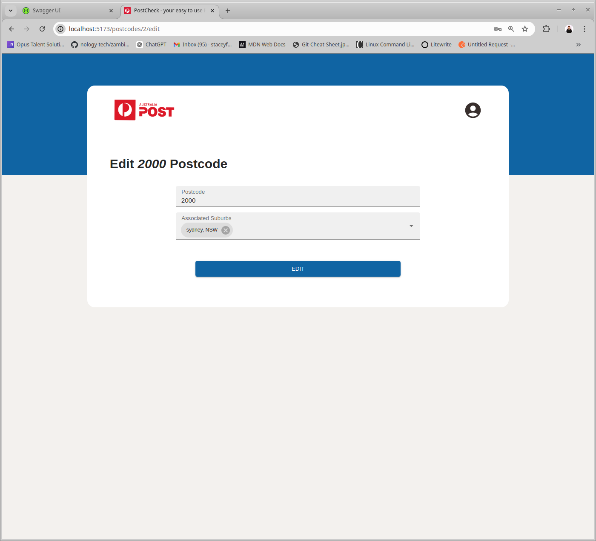
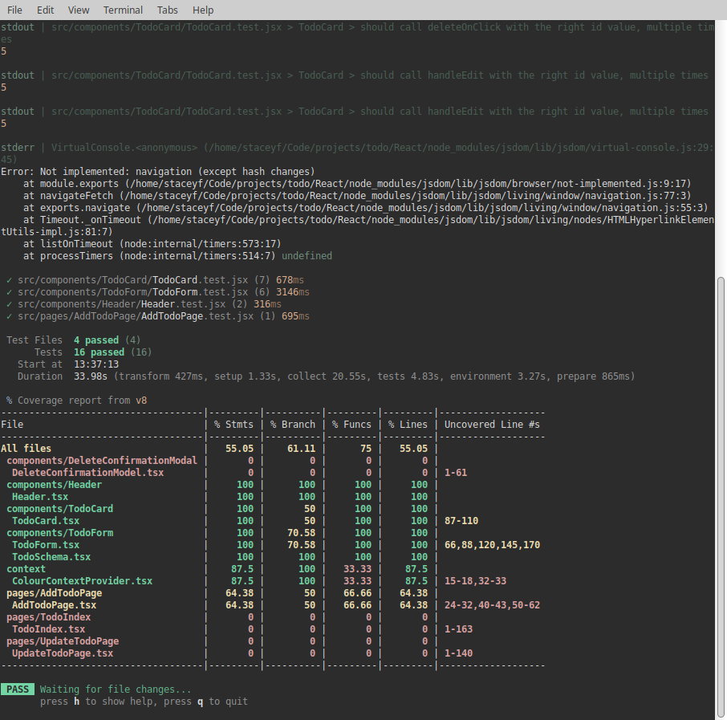

# Welcome to PostChecker-API-Front 

The front end demo for my PostChecker-API backend in Springboot and/or Flask.

Deployed at: https://www.staceyfanner.com/Postcheck-front/

NOTE: I'm in the processing of rebuilding the back end in flask which i plan to dockerise and then deploy with Google Run. This means that the live demo currently does not have a workking backend so watch this space.

  

## Build Steps

1. Clone the repo.
2. Run `npm install` to install the relevant dependencies.
3. Run `npm run dev`.
4. Test with `npm run test`.

## About

In this fictional brief, Aus-Post would like to add authentication to their service (in particular for their creating, updating, and deleting functionalities) that provides postcode and suburb information via an API.

The MVP to deliver on this client brief was:

- Create an API that allows clients to retrieve and add suburb and postcode combinations.
- Implement:
  - An API that allows clients to retrieve suburb information by postcode.
  - An API that allows clients to retrieve a postcode given a suburb name.
- A secured API to add new suburb and postcode combinations.
- Some form of persistence (a database).
- Testing for service layers.

This is the demo front end to showcase some of the functionalities.

## Planning

## Design Inspiration

Given the fictional brief, I used the existing Aus-post Postcode checker as my design inspiration.

  

## Key Features

### Frontend

1. **Full CRUD for Postcodes:** Users are able to create, read, update, and delete new postcodes.
2. **Login and Auth:** Users are able to log in to access restricted areas such as creating, updating, and deleting postcodes.
3. **Component Testing:** Components have a range of tests to ensure elements render as expected.

## Key Learning Highlights

1. **Managing Auth:** The journey of understanding how authentication is implemented and how to store tokens in local storage so that they could be utilized in the header for HTTP requests. 

## To-Dos

1. **Increased functionality:** Build out more frontend functionality like adding a new user form and additional suburb CRUD functionality to be able to update and delete suburbs.

Changelog  
Date: 25/06/24

Updates:

Structure:

Separated the front end app from SpringTasker repo.

## Screenshots

| New Form                              | Update Form                          | Testing - Front                         |
| ------------------------------------- | ------------------------------------ | --------------------------------------- |
|    |  |  |

## Technologies Used

  
  
  
  
  
  
  

